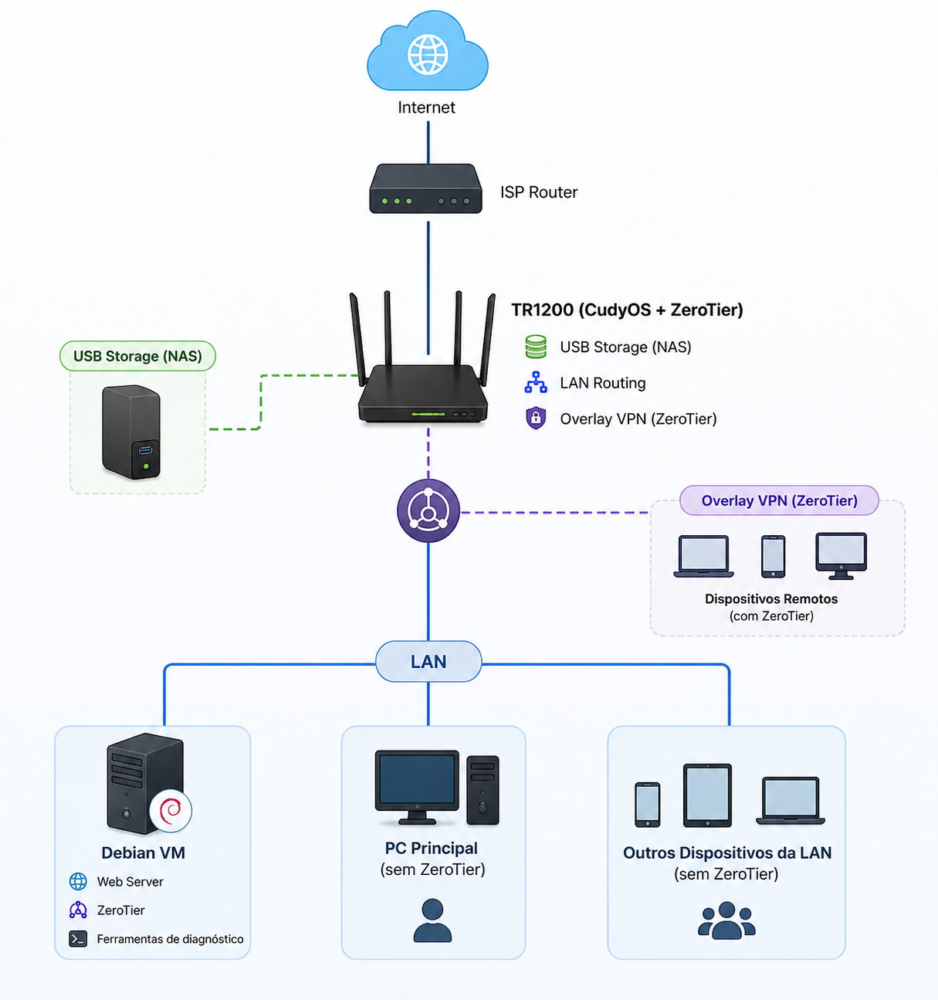

# Lab ZeroTier + Debian VM + TR1200

## Objetivos
- acesso remoto via VPN overlay
- roteamento LAN ↔ VPN
- NAS simples via USB
- web server interno
- acesso transparente para dispositivos sem ZeroTier

---

## Topologia



---

## Componentes

| Dispositivo | Função |
| :--- | ---: |
| TR1200 | Gateway VPN |
| VM Debian ARM64 | Serviços |
| USB Storage | NAS |
| PC principal | Cliente LAN |
| Smartphone | Cliente Remoto |

---

## Provisionamento Debian

### Instalação básica
``` bash
su -
apt update
apt install sudo
usermod -aG sudo USER
```

### Ferramentas de rede
``` bash
sudo apt install net-tools
sudo apt install tcpdump
sudo apt install curl
sudo apt install lynx
``` 

### Diagnóstico
``` bash
ip addr
ps
systemctl status ssh
``` 

### ZeroTier
``` bash
curl -s https://install.zerotier.com | sudo bash
sudo zerotier-cli join NETWORK_ID
```

### Web server e ferramentas de desenvolvimento
``` bash
busybox httpd -f -p 8080 -h . &
sudo apt install python3 python3-pip
sudo apt install snapd
```

### Configuração de IP estático

Em ambientes de laboratório e servidores é recomendado utilizar IP estático para:

- acesso previsível via SSH
- serviços web locais
- compartilhamento SMB/NAS
- VPNs e roteamento
- regras de firewall e VLAN
- acesso remoto via ZeroTier

**Verificar interfaces de rede:**

```bash
ip addr
```

**Editar configuração de rede:**

```bash
sudo nano /etc/network/interfaces
```

**Exemplo DHCP:**

```ini
auto enp0s8
iface enp0s8 inet dhcp
```

**Exemplo IP estático:**

```ini
auto enp0s8
iface enp0s8 inet static
    address 192.168.10.100/24
    gateway 192.168.10.1
    dns-nameservers 1.1.1.1 8.8.8.8
```

**Reiniciar serviço de rede:**

```bash
sudo systemctl restart networking
```

## Configuração da Rede

### 1. Modem/roteador ISP em modo Bridge

**Objetivo:**

- evitar double NAT
- permitir que o TR1200 seja o gateway principal
- centralizar DHCP, roteamento, VPN, firewall

### 2. Configuração do TR1200

**Firmware utilizado**
CudyOS (baseado em Linux / LEDE/OpenWrt)

**Kernel:**
Linux 4.4.140

**Compilador:**
LEDE GCC 5.4.0

### 3. ZeroTier no roteador

**Objetivo:**

- transformar o TR1200 em gateway VPN da LAN
- permitir acesso transparente sem instalar ZeroTier nos clientes locais

**Configurações realizadas:**

- ativação do cliente ZeroTier no CudyOS
- ingresso na rede virtual
- habilitação do roteamento LAN - VPN

**Referência oficial utilizada:**

How to Remote Connect Cudy Router via ZeroTier (https://www.cudy.com/pt-br/blogs/faq/how-to-remote-connect-cudy-router-via-zerotier?utm_source=chatgpt.com)

### 4. Compartilhamento USB / NAS

**Objetivo:**

Disponibilizar armazenamento conectado via USB ao TR1200 para acesso compartilhado:

- na rede local (LAN)
- remotamente via VPN overlay (ZeroTier)

**Serviço utilizado:**
Samba (SMB/CIFS)

**Recursos disponibilizados:**

- armazenamento centralizado em rede
- compartilhamento de arquivos via SMB
- acesso local e remoto através da VPN
- compatibilidade multiplataforma

**Referência oficial utilizada**

How to Configure USB Sharing on Cudy Router (https://www.cudy.com/pt-br/blogs/faq/how-to-configure-usb-sharing-on-cudy-router?utm_source=chatgpt.com)

## Resultado final do laboratório

Recursos funcionando
* Gateway VPN overlay
* Clientes LAN acessando VPN sem ZeroTier
* Web server Debian acessível remotamente
* NAS via USB/Samba
* Roteamento LAN ↔ VPN
* Diagnóstico via tcpdump/traceroute
* VM Debian para serviços