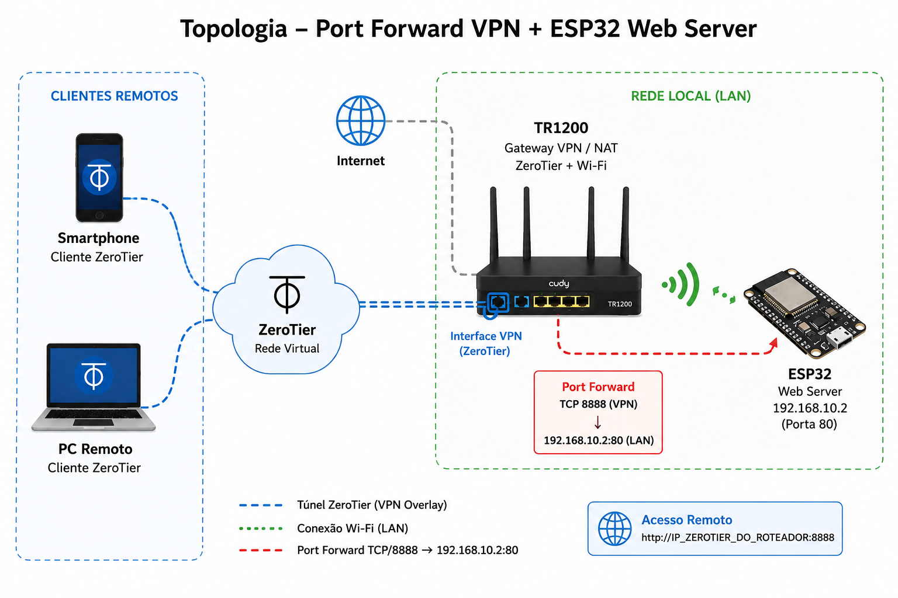

# Lab Port Forward VPN + ESP32 Web Server + ZeroTier

## Objetivos
- disponibilizar um web server ESP32 remotamente
- utilizar VPN overlay para acesso seguro
- implementar port forwarding via roteador
- estudar NAT e redirecionamento de portas
- integrar ESP32 com infraestrutura VPN

---

## Topologia



---

## Componentes

| Dispositivo | Função |
| --- | --- |
| TR1200 | Gateway VPN / NAT |
| ESP32 | Web Server embarcado |
| ZeroTier | VPN overlay |
| Smartphone | Cliente remoto |
| PC remoto | Cliente VPN |

---

## Objetivo do laboratório

O objetivo deste laboratório foi disponibilizar remotamente um web server hospedado em um ESP32, utilizando uma rede VPN overlay via ZeroTier executando diretamente no roteador TR1200.

Através de regras de port forwarding aplicadas na interface VPN do roteador, foi possível acessar o serviço HTTP do microcontrolador remotamente, sem necessidade de instalar ZeroTier diretamente no ESP32.

---

# Arquitetura utilizada

O cliente remoto conecta-se à rede virtual ZeroTier.

O roteador TR1200 participa da VPN e realiza:

- roteamento VPN ↔ LAN
- NAT
- port forwarding
- acesso transparente aos dispositivos locais

Fluxo simplificado:

```txt
Cliente remoto
       ↓
Rede ZeroTier
       ↓
TR1200
       ↓
Port Forward
       ↓
ESP32 Web Server
```

---

# Configuração do ZeroTier no roteador

## Objetivo

Executar o cliente ZeroTier diretamente no TR1200, permitindo:

- acesso remoto à LAN
- roteamento transparente
- acesso a dispositivos sem cliente VPN
- integração entre VPN e rede local

---

## Configuração realizada

Todo o processo foi realizado via interface LuCI/CudyOS.

Menu utilizado:

```txt
VPN → ZeroTier
```

Etapas:

- ativação do cliente ZeroTier
- ingresso na rede virtual
- autorização do dispositivo na controller
- habilitação do roteamento LAN ↔ VPN

---

# Configuração do Port Forward

## Objetivo

Redirecionar conexões recebidas pela interface VPN do roteador diretamente para o ESP32 na rede local.

---

## Configuração via LuCI

Menu utilizado:

```txt
Network → Port Forwards
```

Regra criada:

| Campo | Valor |
| :--- | :--- |
| Nome | ESP32_HTTP |
| Protocolo | TCP |
| Interface | VPN |
| External Port | 8888 |
| Internal IP | 192.168.10.2 |
| Internal Port | 80 |

---

# Funcionamento

## Cliente remoto

Conectado à rede ZeroTier:

```txt
http://IP_ZEROTIER_DO_ROTEADOR:8888
```

---

## Fluxo da conexão

```txt
Cliente remoto
    ↓
Interface ZeroTier do TR1200
    ↓
Port Forward TCP/80
    ↓
ESP32 192.168.10.2:80
```

---

# Conceitos estudados

- VPN overlay
- ZeroTier
- port forwarding
- NAT
- roteamento VPN ↔ LAN
- integração IoT + VPN
- acesso remoto
- infraestrutura OpenWrt

---

# Resultado final do laboratório

Recursos funcionando:

- VPN overlay operacional
- roteador participando da VPN
- acesso remoto transparente
- ESP32 acessível remotamente
- port forwarding via interface VPN
- integração ESP32 + ZeroTier
- gerenciamento via LuCI

---

# Considerações finais

Este laboratório demonstrou como um roteador Linux/OpenWrt pode atuar como gateway VPN para dispositivos embarcados que não possuem cliente VPN próprio.

A utilização do ZeroTier diretamente no TR1200 permitiu integrar toda a rede local à VPN overlay, enquanto o port forwarding tornou possível publicar serviços específicos do ESP32 para acesso remoto controlado.

A arquitetura utilizada aproxima-se de cenários reais de edge computing, IoT e acesso remoto seguro para dispositivos embarcados.