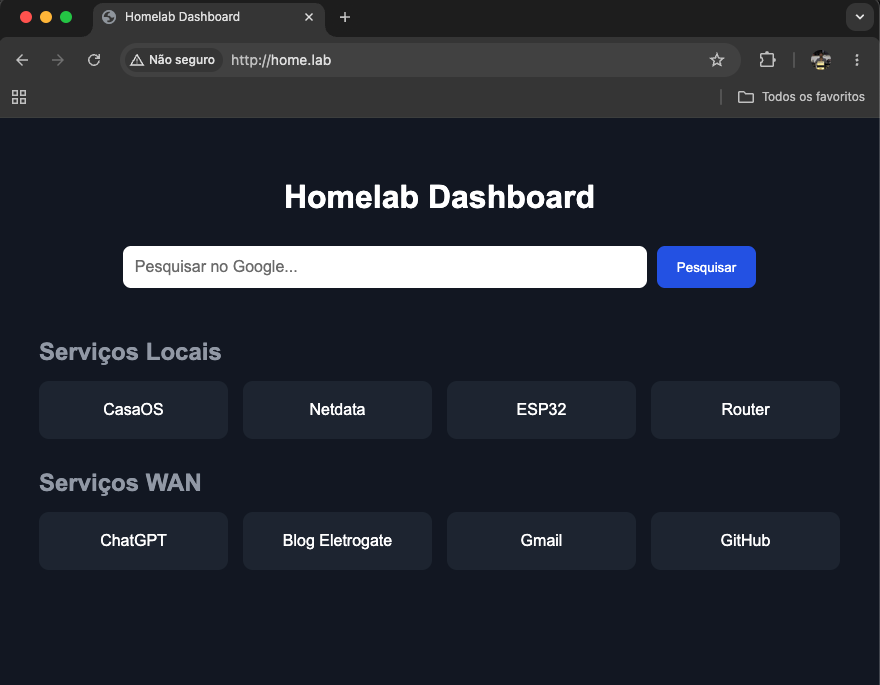

# Lab 6 - Dashboard Pessoal com Nginx e Proxy Reverso

## Objetivo

Centralizar o acesso aos serviços da rede local através de nomes amigáveis, eliminando a necessidade de memorizar endereços IP e portas.

### Antes

```text
http://192.168.1.10:81
http://192.168.1.10:19999
```

### Depois

```text
http://casaos.lab
http://netdata.lab
http://dashboard.lab
```

A resolução dos nomes é feita pelo servidor DNS local, enquanto o Nginx atua como proxy reverso encaminhando as requisições para os serviços corretos.

---

## Arquitetura

```text
                Cliente LAN
                       │
                       ▼
                 DNS Interno
                       │
             *.lab → 192.168.1.10
                       │
                       ▼
                    Nginx
                 Porta 80
                       │
      ┌────────────────┼────────────────┐
      │                │                │
      ▼                ▼                ▼

 casaos.lab      netdata.lab      dashboard.lab
     │                │                │
     ▼                ▼                ▼

 localhost:81   localhost:19999   /var/www/html
```

---

## Instalação do Nginx

Atualizar os repositórios:

```bash
sudo apt update
```

Instalar o servidor web:

```bash
sudo apt install nginx
```

Verificar o serviço:

```bash
systemctl status nginx
```

---

## Configuração do Firewall

Instalar o UFW:

```bash
sudo apt install ufw
```

Listar perfis disponíveis:

```bash
sudo ufw app list
```

Liberar serviços necessários:

```bash
sudo ufw allow SSH
sudo ufw allow DNS
sudo ufw allow 'Nginx HTTP'
```

Caso algum serviço utilize uma porta específica:

```bash
sudo ufw allow PORTA/protocolo
```

Exemplo:

```bash
sudo ufw allow 9999/tcp
```

Ativar o firewall:

```bash
sudo ufw enable
```

Consultar regras:

```bash
sudo ufw status numbered
```

---

## Página Inicial

Criar uma página simples para servir como dashboard:

```bash
sudo nano /var/www/html/index.html
```

Exemplo:

```html
<h1>Homelab</h1>

<ul>
  <li><a href="http://casaos.lab">CasaOS</a></li>
  <li><a href="http://netdata.lab">Netdata</a></li>
</ul>
```

---

## Site Principal

Criar a configuração principal:

```bash
sudo nano /etc/nginx/sites-available/homepage
```

```nginx
server {
    listen 80 default_server;

    server_name _;

    root /var/www/html;
    index index.html;
}
```

Habilitar:

```bash
sudo ln -s /etc/nginx/sites-available/homepage \
           /etc/nginx/sites-enabled/
```

Remover o site padrão:

```bash
sudo rm /etc/nginx/sites-enabled/default
```

Validar:

```bash
sudo nginx -t
```

Recarregar:

```bash
sudo systemctl reload nginx
```

---

## Publicando Serviços com Proxy Reverso

O proxy reverso permite que múltiplos serviços sejam acessados pela porta 80 utilizando nomes diferentes.

### CasaOS

Criar:

```bash
sudo nano /etc/nginx/sites-available/casaos
```

```nginx
server {
    listen 80;

    server_name casaos.lab;

    location / {
        proxy_pass http://127.0.0.1:81;

        proxy_set_header Host $host;
        proxy_set_header X-Real-IP $remote_addr;
        proxy_set_header X-Forwarded-For $proxy_add_x_forwarded_for;
        proxy_set_header X-Forwarded-Proto $scheme;
    }
}
```

Habilitar:

```bash
sudo ln -s /etc/nginx/sites-available/casaos \
           /etc/nginx/sites-enabled/
```

---

### Netdata

Criar:

```bash
sudo nano /etc/nginx/sites-available/netdata
```

```nginx
server {
    listen 80;

    server_name netdata.lab;

    location / {
        proxy_pass http://127.0.0.1:19999;

        proxy_set_header Host $host;
        proxy_set_header X-Real-IP $remote_addr;
        proxy_set_header X-Forwarded-For $proxy_add_x_forwarded_for;
        proxy_set_header X-Forwarded-Proto $scheme;
    }
}
```

Habilitar:

```bash
sudo ln -s /etc/nginx/sites-available/netdata \
           /etc/nginx/sites-enabled/
```

---

## Validação

Verificar os sites habilitados:

```bash
ls -l /etc/nginx/sites-enabled/
```

Testar a configuração:

```bash
sudo nginx -t
```

Recarregar:

```bash
sudo systemctl reload nginx
```

---

## Integração com o DNS

Os registros DNS internos apontam todos para o IP da VM:

```text
casaos.lab     → 192.168.1.10
netdata.lab    → 192.168.1.10
dashboard.lab  → 192.168.1.10
```

O Nginx identifica o nome solicitado através da diretiva `server_name` e encaminha a requisição para o serviço correspondente.

---

## Resultado

A VM passa a fornecer:

* Dashboard centralizado
* Resolução DNS local
* Proxy reverso para múltiplos serviços
* Firewall configurado
* Acesso simplificado por nomes

Exemplos:

```text
http://dashboard.lab
http://casaos.lab
http://netdata.lab
```

Com essa estrutura, novos serviços podem ser publicados criando apenas um novo bloco `server` no Nginx e um registro DNS correspondente.


